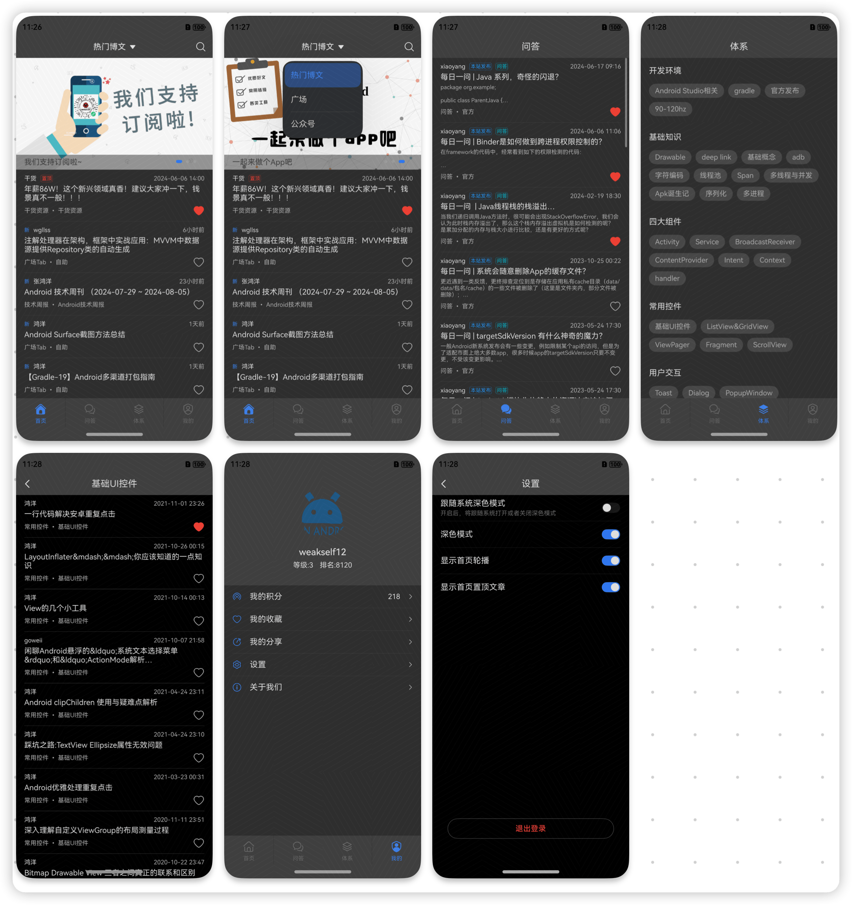

# 玩 Android 客户端  鸿蒙版

作为一个 iOSer 初入鸿蒙，参考网上的诸多项目，基于 [玩Android 开放API](https://www.wanandroid.com/blog/show/2) 做了一个鸿蒙版本的客户端，目前功能还不够完善，迭代更新中。

## 开发环境

* DevEco Studio NEXT Developer Beta2
* 构建版本：5.0.3.500
* Harmony OS API 12

## 截图

## 功能迭代

### 首页

* [x] ~~增加广场入口~~

* [x] ~~增加公众号入口~~

### 个人中心

* [x] ~~我的积分~~
* [x] ~~我的收藏~~
* [x] ~~我的分享~~
* [x] ~~系统设置~~
* [x] ~~关于我们~~

### 基础框架

* [x] ~~重新封装网络请求~~

## 感谢

UI 参考了：<https://github.com/goweii/WanAndroid>  

初建项目时参考了：<https://github.com/wangchenyan/wan-harmony>

感谢大佬的项目
